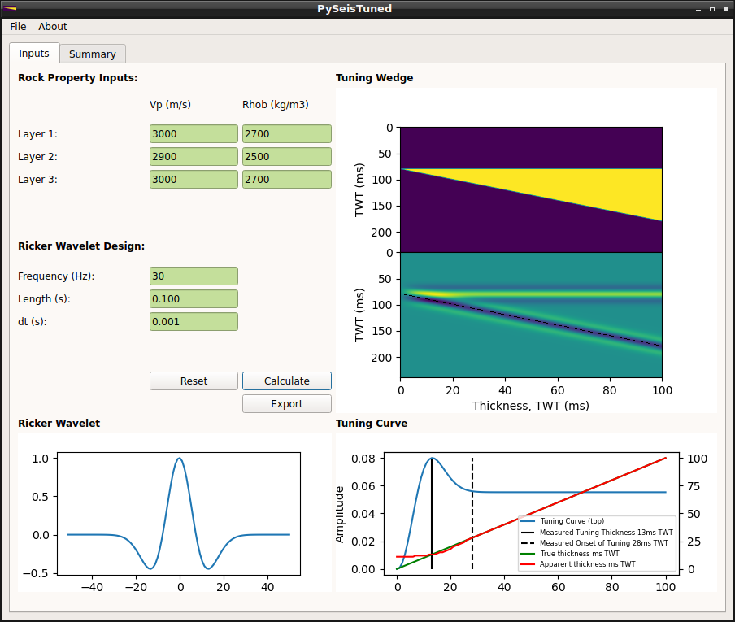
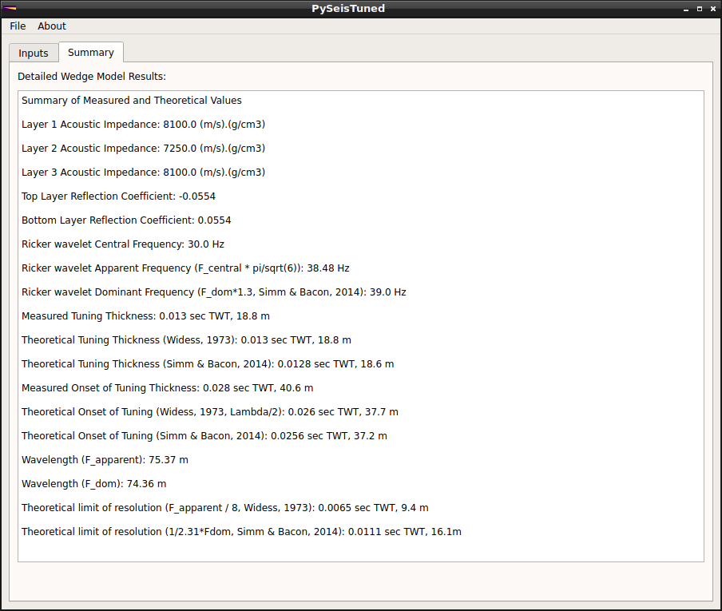

# PySeisTuned
Seismic Tuning Wedge calculator using PyQT

[](https://www.codacy.com/manual/bdowdell/PySeisTuned?utm_source=github.com&amp;utm_medium=referral&amp;utm_content=bdowdell/PySeisTuned&amp;utm_campaign=Badge_Grade)

This project is inspired by one of Agile Scientific's "X lines of code" Jupyter notebooks, found [here](https://github.com/agile-geoscience/xlines/blob/master/notebooks/00_Synthetic_wedge_model.ipynb "00_Synthetic_wedge_model.ipynb")





## Getting Started
### 1) Set up an environment with the required dependencies
This project was built using Python 3.6.8 and PyQT5.  There are two environment files provided to set up a conda environment for running the program:

1) environment.yml

2) requirements.txt

To set up your environment, at the terminal enter either:

```bash
$ conda env create -f environment.yml
```
or
```bash
$ conda create -n env_name -f requirements.txt
```
Where env_name is whatever name you want to give the environment.

You can activate the new environment by entering the following at the terminal:

```bash
$ conda activate pst
```

If you used the environment.yml, the new environment will be called pst.  If you used the requirements.txt, it will be the name you entered at the command line.  You can always check your conda environments as follows:

```bash
$ conda env list
```

### 2) Launch the GUI from the terminal
Enter the src/ directory and at the terminal, enter:

```bash
$ ./PySeisTuned.py
```

The GUI will launch.
